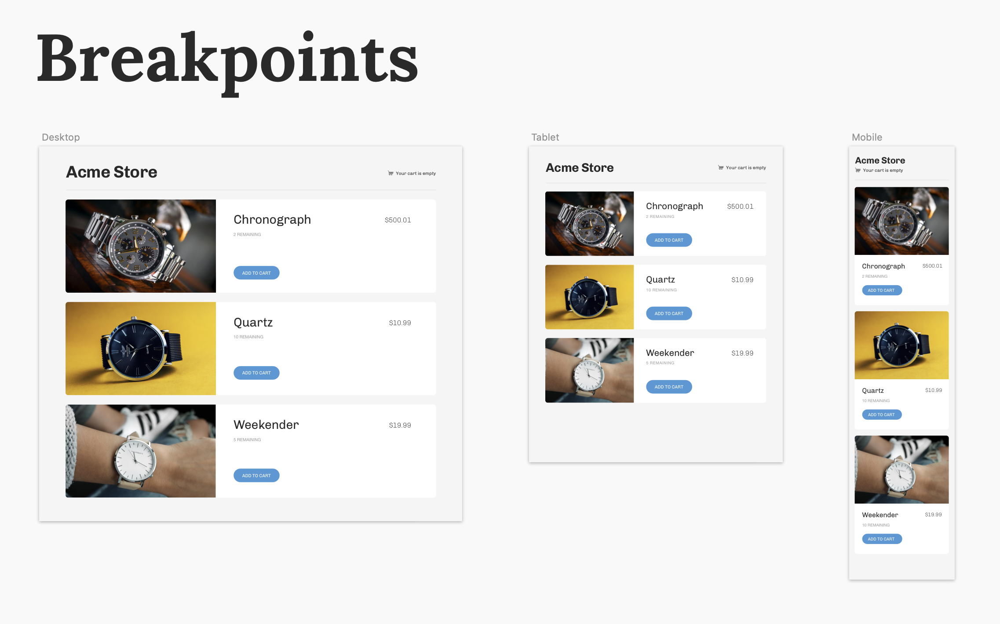
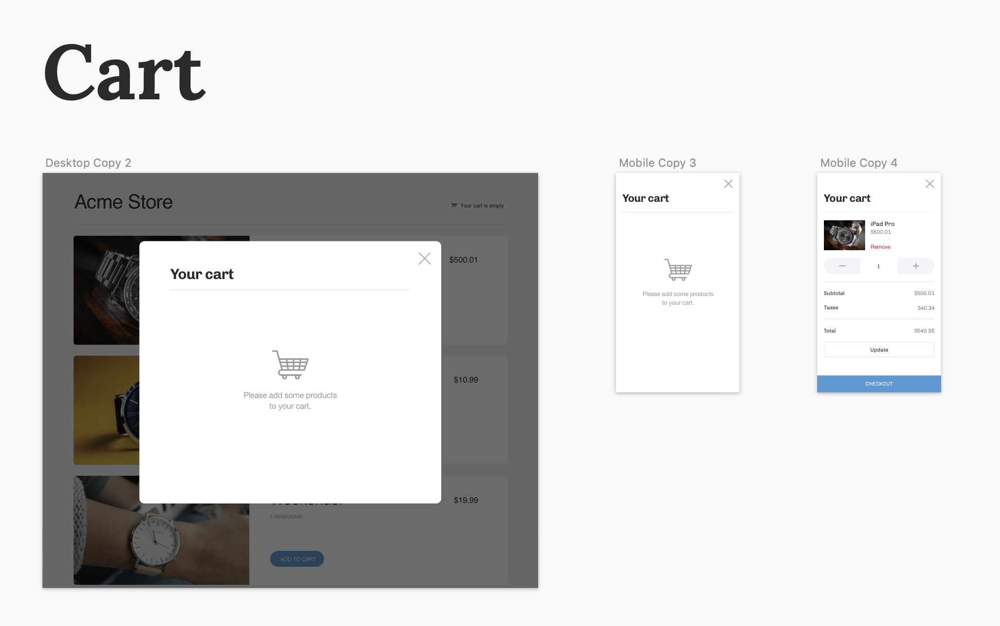
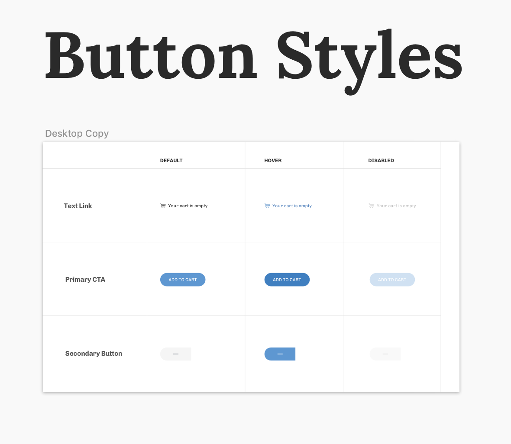

# Task 01 - Implement Responsive Design

The product you are building is a responsive e-commerce site consisting of:

### 1. A product landing page

### 2. A cart overlay

There are also several states to consider:

### 1. Buttons

### Instructions

Download the Sketch file [here](../assets/Design.sketch). You can get a free trial from [Sketch](https://www.sketchapp.com/) if you don't have it installed already. Windows users can download [Lunacy](https://icons8.com/lunacy) for free.

Implement to the best of your ability the given design based on the starter boilerplate.

#### A couple of things to keep in mind:

- Please make your work [responsive, not adaptive](https://css-tricks.com/the-difference-between-responsive-and-adaptive-design/).
- You will have to implement the button that opens the cart (in the designs this button reads "Your cart is empty").
- Some designs (like the cart on tablet) are missing. Please implement what you think is best. Hopefully this won't happen in real life, but we want to see how you handle a missing design 🙂
